Blog Article Published by Analytics Vidhya, Medium : [Predicting Functionality of Water Well Pumps in Tanzania](https://medium.com/analytics-vidhya/predicting-functionality-of-water-well-pumps-in-tanzania-using-random-forest-6c25844a517e)

# Project Introduction
Tanzania is in the midst of a water crisis. 1/3 of the land is an arid desert and there is very limited access to clean water for residents that don’t live near one of the three major lakes on the border of the country. The Tanzanian government and several private companies have built drinking water wells all around the country, however their water pumps don’t work much of the time. Many people resort to drinking contaminated groundwater (found openly), while pollution runs largely unregulated, leaving the possibility of health problems in the open. The people need our help!

# Goals 
The goal of this project is to perform a ternary classification of the functionality of water wells in Tanzania. I will use data originally obtained from taarifa, an open-source API, and the Tanzanian Ministry of Water. I will practice and demonstrate the employment of logistic regression, by training and testing multiple supervised ensemble methods of machine learning. The deliverable will be visualizations of the most important features for proper classification using the most accurate model.

## Necessary libraries for this project
* Pandas
* NumPy
* Matplotlib
* Seaborn
* SciPy
* sklearn
* XGBoost 

# Methods
Process based on the OSEMN framework
* Importing data obtained from host, DrivenData.org
* Extensive cleaning:
    * Dropping entirely redundant columns where values are near duplicates of other columns (e.g.'subvillage', 'funder', 'quality       group' columns)
    * Dealing with missing values:
        * Dropping rows when NaN ratio is very low 
        * Imputing high NaN ratio with 'unknown' to avoid offsetting distribution of data ('funder' column)
        * Imputing low-mid NaN ratios with existing ratios of non-null values ('permit' column)
    * Dealing with placeholder values:
        * Dropping 'longitude' rows with '0' and '-2.000000e-08' (3% of all values)
        * Dropping others entire rows with extremely high percentage of placeholders ('num-private' column)
* Exploratory Data Analysis, potential relationships between variables/columns and functionality labels
* One-Hot-Encoding categorical variables
* Modeling and tuning for highest accuracy, and highest precision of non-functional well identification with the following                 models:
        * KNNclassifier (K Nearest Neighbors)
        * Decision tree
        * Random Forest
        * XGBoost
* Plotting feature importance of best performing model (Random Forest)
* Visualizing most important features

## The Data
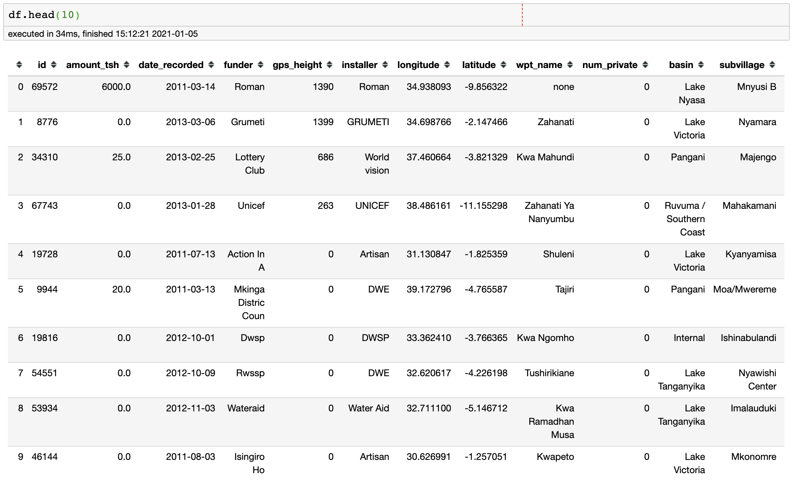
**Labels**:
Functional
Functional Needing Repair
Non-Functional

Some of the less obvious column definitions, taken from the competition page:
**amount_tsh**: Total static head (amount water available to waterpoint)
**basin**: Geographic water basin
**scheme_management**: Who operates the waterpoint
**extraction_type**: The kind of extraction the waterpoint uses
**quality_group**: The quality of the water

## Exploratory Data Analysis
Exploring potential relationships of variables to functionality status

### Does location have anything to do with well functionality?
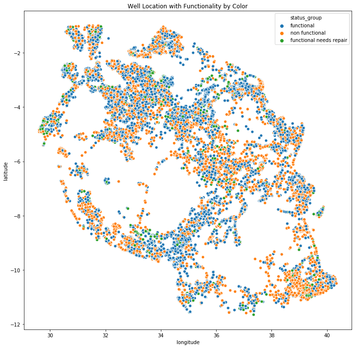
There seems to be a cluster of more non-functional wells in the lower, south-east corner of Tanzania.

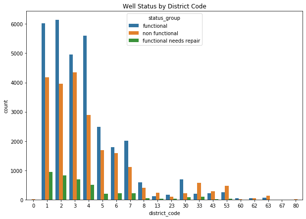
For some of these higher district codes, like 13, 33, 43, 53, 63, & 80, more wells are non-functional than functional.

### Does water-quality have an effect on functionality?
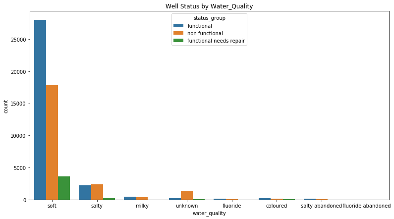
Salty water wells are more likely to be non-functional! 'Unknown' water-quality is also usually non-functional. Perhaps this are wells that don't have any water coming out? Bigger takeawau though is that 90% or so of the wells are soft water.

### 'water_quantity' vs functionality
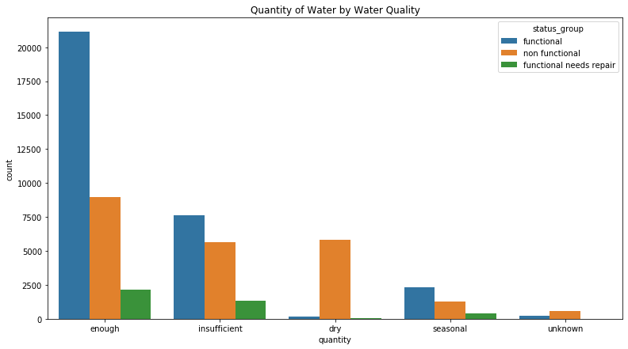
Dry well are almost always non_functional wells, with insufficient quantity highly non_functional as well. This tells us that functionality is closely tied to water quantity.

### 'installer' vs functionality
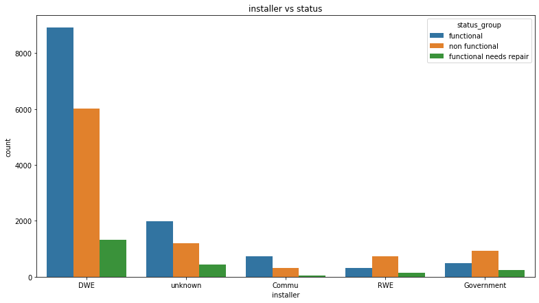
Hmm, it seems RWE and the Government installed wells, are prone to not functioning! 

### 'Extraction_type' vs functionality
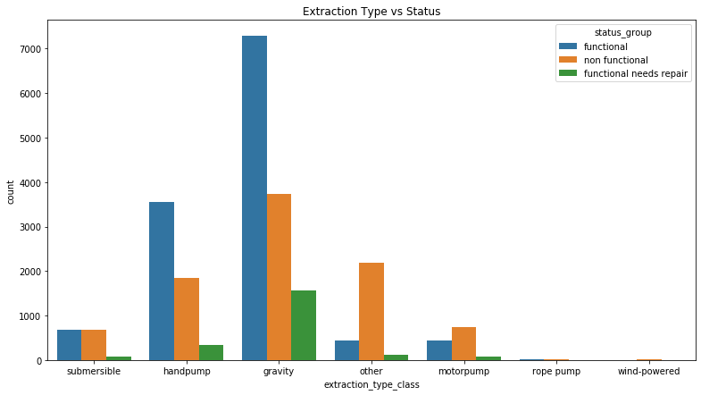
Nearly half of submersible water-wells don't work. Handpump wells and gravity wells mostly work. Motorpumps are mostly not working. Water wells that aren't any of these main types are prone to breaking as well it seems.

## Best Classification Model: Random Forest

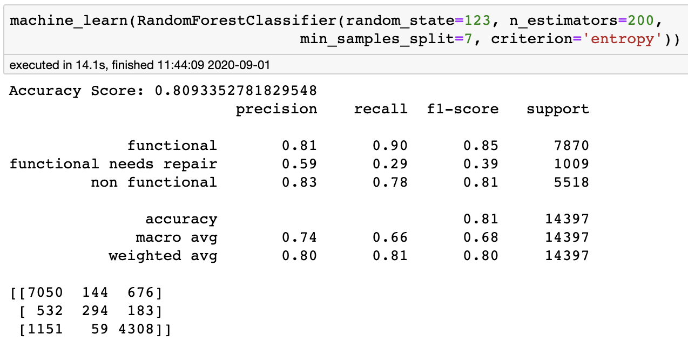

Our best accuracy and false negative ratio utilized a random forest model. Precision for functional needs repair went from 50% at the baseline to 59% after fine-tuning. Our recall went up to 90% for functional, bumping the f1-score up 1%. The f1-score for non-functional also went up 1%, thus bumping our accuracy up 1%. Most importantly precision for non-functional well classification at 83%. Final model accuracy at 80.9%. 

### Confusion Matrix for Test Set 

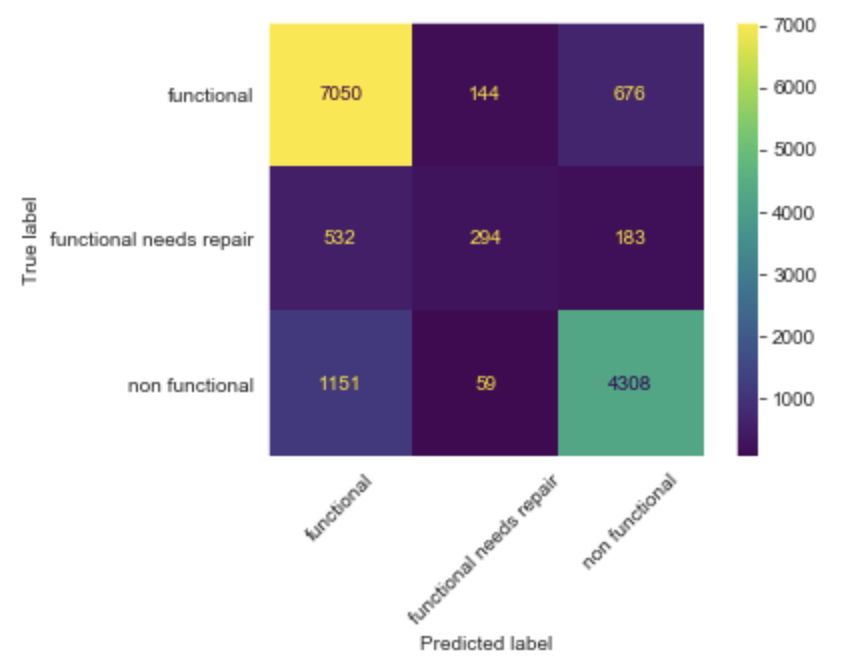

Deciphering the confusion matrix on the unseen test data: 7050 wells were correctly predicted as functional (Upper Right corner). 532 were falsely predicted as functional, when they were actually needing repair. 1151 were falsely predicted as functional when they were not functional (false positives - important in our case).

## Most Imporant Features from Best Model

An extremely important part of any machine learning classification project shows the features which are most important to the particular model in determining the classification outcome. 

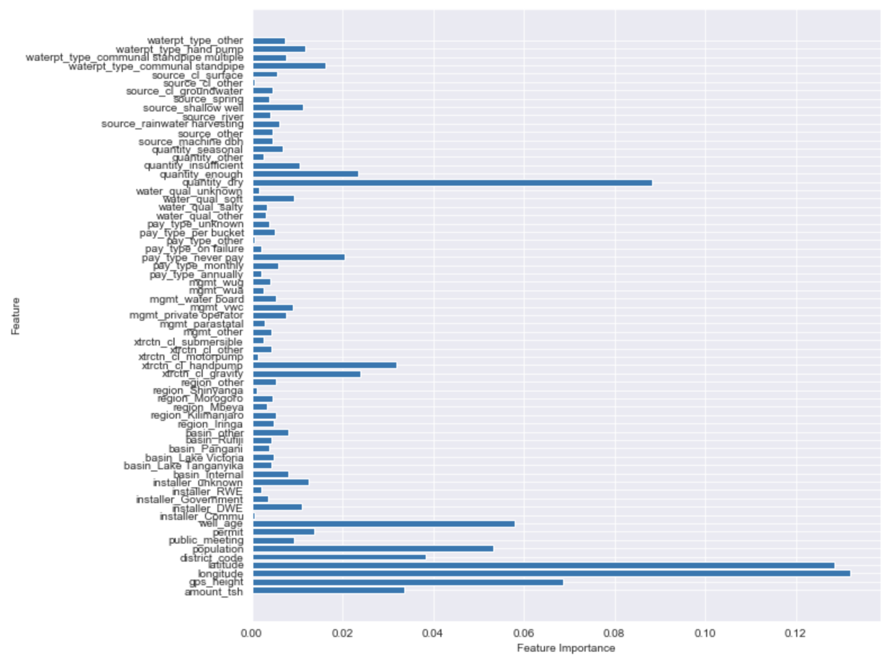

The following features in our model are most determinant of well functionality label:
* latitude and longitude 
* age of the well
* gps_height
* and the quantity of water the pump gives out

## Best Performing Model Visualizations

#### Water Quantity by Status

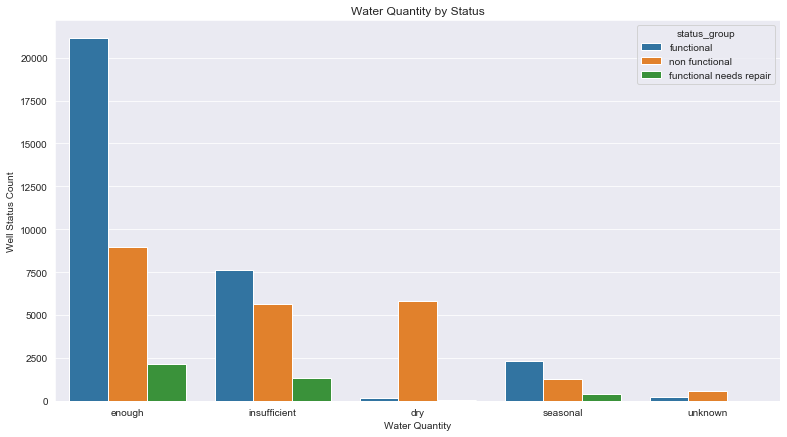

#### Quantity & Location

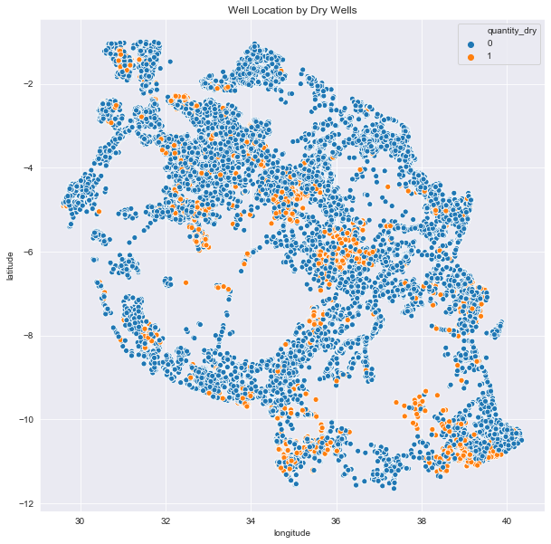

#### Age, Location & Functionality

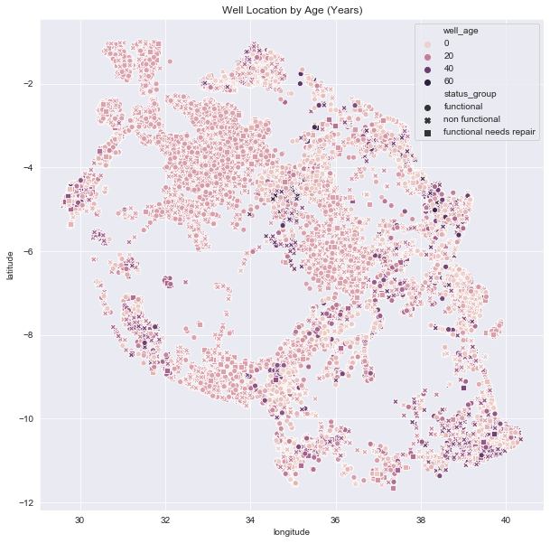

#### Well Status by Age

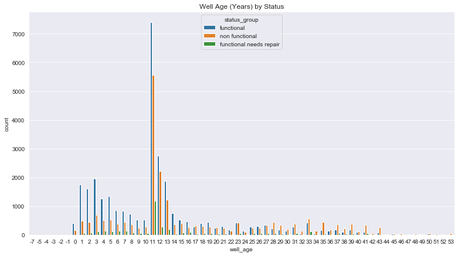

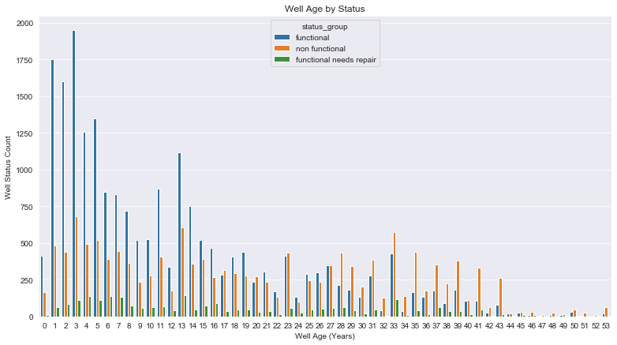

#### Extraction Type Class by Functionality

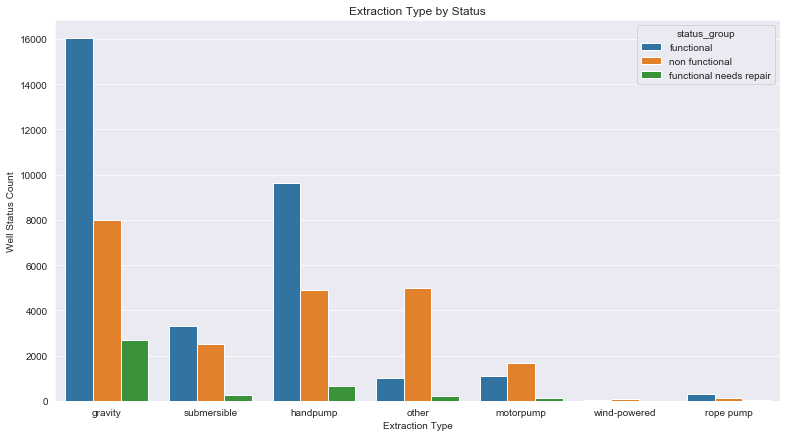
